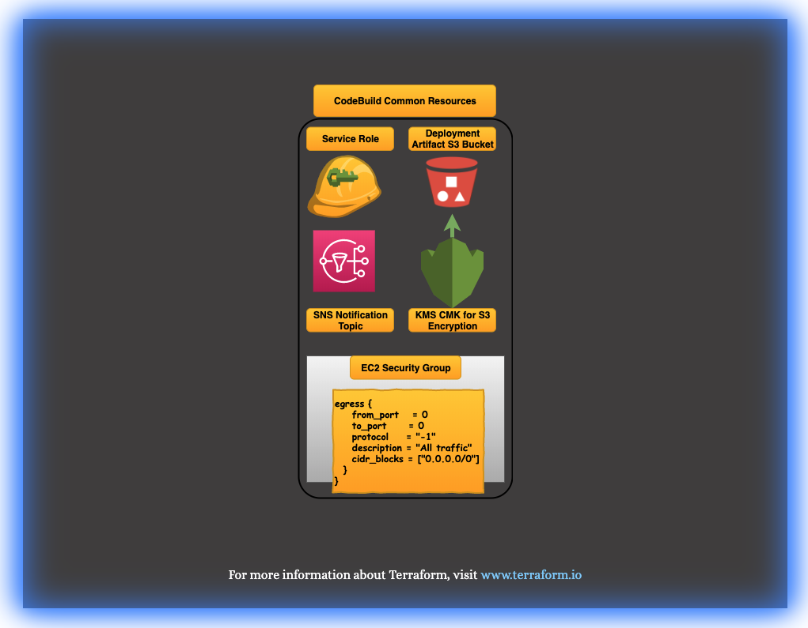

<!-- VSCode Markdown Exclusions-->
<!-- markdownlint-disable MD025 Single Title Headers-->
# TF AWS CodeBuild Lambda Deployment Pipeline Common Root

<br>

  

<br>

# Getting Started

This Terraform project root module has been created to provide all of the required common components needed by Codebuild to allow CodeBuild to create, update, maintain, and destroy lambda functions. CodeBuild Jobs will be later deployed and configured to accept incoming webhooks from a selected git provider for lambda repositories, and when notified by a webhook request, CodeBuild will clone the repository, build the function code and then either create the function or update the function code if the function has already previously been deployed. The purpose of this project is to create the common or shared resources that many such CodeBuild projects can use making it easier to deploy new Lambda functions without having to worry about constantly spinning up duplicated resources.

<br><br>

# Module Pre-Requisites and Dependencies

This project will deploy all of the resources required and will become a dependency for future Lambda pipeline projects.

<br><br>

# Module Requirements

This project root module will rely on the following modules to create the resources required:

- [KMS CMK Module](https://github.com/CloudMage-TF/AWS-KMS-Module.git)
- [S3 Encrypted Bucket Module](https://github.com/CloudMage-TF/AWS-S3Bucket-Module.git)
- [CodeBuild Lambda Deployment Role](https://github.com/CloudMage-TF/AWS-CodeBuild-Lambda-Deployment-Pipeline-Role-Module.git)

<br><br>

# Resource Provisioning

This project root module will create the following resources required for future CodeBuild Lambda deployments:

<br>

## CodeBuild Role

The Role that this project will provide is a common role that allows CodeBuild to deploy Lambda functions. It is being separated from any individual Lambda deployment TF project so that multiple projects that contain Lambda function only deployments can be built using a common role instead of having N number of roles provisioned that all would otherwise have the same permission sets, which are the permissions required to provision and deploy Lambda functions

- Used by the CodeBuild service to allocate service resources required by CodeBuild projects to execute
- Allow the creation of CloudWatch log streams, and log writing
- Access to the CodeBuild Lambda deployment artifact S3 bucket
- User access on the CodeBuild CMK, allowing the encryption, decryption, and re-encryption of build artifacts stored on S3
- Access to publish messages on the CodeBuild Lambda deployment event notification topic
- Access to create, update, maintain, and destroy Lambda function deployments.
- Permissions to pass IAM roles to the functions that CodeBuild is responsible to deploy.
- Resource provisioning will be handled by the - [CloudMage CodeBuild Lambda Deployment Role Module](https://github.com/CloudMage-TF/AWS-CodeBuild-Lambda-Deployment-Pipeline-Role-Module.git)

<br><br>

## KMS Customer-Managed Encryption Key

KMS Customer Managed Key (CMK) that will be provisioned and used to encrypt and decrypt both objects stored in S3 as well as the SNS Topic notifications.

- KMS CMK that will be used to encrypt various elements of CodeBuild Lambda deployment pipeline projects
- CodeBuild will use this CMK to encrypt build artifacts being stored in S3
- CodeBuild will use this CMK to encrypt SNS CodeBuild event notifications
- KMS CMK provisioning will be handled by the [CloudMage KMS CMK Module](https://github.com/CloudMage-TF/AWS-KMS-Module.git)

<br><br>

## CodeBuild S3 Deployment Artifact Bucket

Common deployment artifact bucket that CodeBuild will use for all lambda function deployment projects that require the use of an S3 bucket.

- S3 bucket will be used for various CodeBuild Lambda Deployment projects to store and retrieve build artifacts
- Encryption will be forced within the CodeBuild bucket by an automatic Bucket Policy
- Uploads to the bucket must occur over SSL, Encryption in transit is enforced inbound
- All objects being uploaded must be encrypted by either a KMS CMK, or the AWS Managed aws/s3 KMS Key
- If `aws:kms` is used for object encryption, the CMK ARN must be sent with the put object request
- S3 Bucket provisioning will be handled by the [CloudMage S3 Encrypted Bucket Module](git@github.com:CloudMage-TF/AWS-S3Bucket-Module.git)

<br><br>

## CodeBuild SNS Notification Topic

This SNS topic will be used for notifications for the encountering of any errors or failures that may be incurred during the deployment of a lambda function by CodeBuild. Again this single common topic will be passed to any Lambda deployment CodeBuild jobs that are provisioned in the future.

- SNS topics will be used to notify stakeholders of CodeBuild execution events.
- The topic will be encrypted with the provisioned KMS CMK.
- SNS topic provisioning will be handled directly by this project root module

<br><br>

## CodeBuild Security Group

This SG is a simple SG that allows CodeBuild outbound access so that it can update and download dependencies required by the build environment for Lambda specific CodeBuild jobs. It currently allows no ingress and egress to any.

- Security Group will allow all traffic outbound to allow the CodeBuild environment to update and install any required build dependencies.
- Inbound traffic will not be configured on the Security Group.
- Security Group provisioning will be handled directly by this project root module.

<br><br>

# Terraform Variables

Module variables that need to either be defined or re-defined with a non-default value can easily be hardcoded inline directly within the module call block or from within the root project that is consuming the module. If using the second approach then the root project must have it's own custom variables defined within the projects `variables.tf` file with set default values or with the values provided from a separate environmental `terraform.tfvar` file. Examples of both approaches can be found below. Note that for the standards used within this documentation, all variables will mostly use the first approach for ease of readability.

<br>

> __NOTE:__ There is also a third way to provide variable values using Terraform data sources. A data source is a unique type of code block used within a project that either instantiates or collects data that can be referenced throughout the project. A data source, for example,  can be declared to read the terraform state file and gather all of the available information from a previously deployed project stack. Any of the data contained within the data source can then be referenced to set the value of a project or module variable.

<br><br>

## Setting Variables Inline

```terraform
module "kms" {
  source = "git@github.com:CloudMage-TF/AWS-KMS-Module?ref=v1.0.3"

  // Required Variables
  kms_key_alias_name        = "prod/s3"
}
```

<br><br>

## Setting Variables in a Terraform Root Project

<br>

### Terraform Root Project/variables.tf

```terraform
variable "cmk_alias" {
  type        = string
  description = "Meaningful Description"
}
```

<br>

### Terraform Root Project/terraform.tfvars

```terraform
cmk_alias = "dev/ebs"
```

<br>

### Terraform Root Project/main.tf

```terraform
module "kms" {
  source = "git@github.com:CloudMage-TF/AWS-KMS-Module?ref=v1.0.3"

  // Required Variables
  kms_key_alias_name = var.cmk_alias
}
```

<br><br>

# Required Variables

The following required module variables do not contain default values and must be set by the consumer of the module to use the module successfully.

<br><br>

## :red_circle: vpc_id

<br>


<br>

This variable value defines the target VPC where the CodeBuild Security Group will be created. The VPC Id can be defined as a string value or also be obtained using a TF data source if the VPC was previously deployed using Terraform and provided that this project root module has the necessary permissions to query the TF state file.

<br>

### Declaration in variables.tf

```terraform
variable "vpc_id" {
  description = "The id of the VPC that the CodeBuild Security Group will be placed in. This information can also be gathered from a data source if the VPC was deployed using TF."
  type        = string
}
```

<br><br>

# Optional Variables

The following optional module variables are not required because they already have default values assigned when the variables where defined within the modules `variables.tf` file. If the default values do not need to be changed by the root project consuming the module, then they do not even need to be included in the root project. If any of the variables do need to be changed, then they can be added to the root project in the same way that the required variables were defined and utilized. Optional variables also may alter how the module provisions resources in the cases of encryption or IAM policy generation. A variable could flag an encryption requirement when provisioning an S3 bucket or Dynamo table by providing a KMS CMK, for example. Another use case may be the passage of ARN values to allow users or roles access to services or resources, whereas by default permissions would be more restrictive or only assigned to the account root or a single IAM role. A detailed explanation of each of this modules optional variables can be found below:

<br><br>

## :large_blue_circle: provider_region

<br>


<br>

This variable value defines the region that all of the resources that this project root module produces are deployed in.

<br>

### Declaration in variables.tf

```terraform
variable "provider_region" {
  description = "The region where this project will be provisioned within AWS."
  type        = string
  default     = "us-east-1"
}
```

<br><br><br>

## :large_blue_circle: sns_topic_name

<br>


<br>

This variable value defines the name that will be given to the created CodeBuild event notification topic. This variable is optional, if no value is set, then the default value of `codebuild_lambda_deployment_pipeline_event_notifications` will be used to name the topic.

<br>

### Declaration in variables.tf

```terraform
variable "sns_topic_name" {
  type        = string
  description = "Name of the SNS Topic that will be used for Lambda build and deployment notifications."
  default     = "codebuild_lambda_deployment_pipeline_event_notifications"
}
```

<br><br><br>

## :large_blue_circle: sns_display_name

<br>


<br>

This variable value defines the display name that will be given to the created CodeBuild event notification topic. This variable is optional, if no value is set, then the default value of `CodeBuild-Lambda-Deployment-Pipeline-Event-Notifications` will be used as the display name of the topic.

<br>

### Declaration in variables.tf

```terraform
variable "sns_display_name" {
  type        = string
  description = "Display Name of the SNS Topic that will be used for Lambda build and deployment notifications."
  default     = "CodeBuild-Lambda-Deployment-Pipeline-Event-Notifications"
}
```

<br><br><br>

## :large_blue_circle: security_group_name

<br>


<br>

This variable value defines the name that will be given to the CodeBuild security group on creation. This is an optional variable if no value is defined, then the default value of `CodeBuild-Lambda-Pipeline-SG` will be given for the Security Group Name.

<br>

### Declaration in variables.tf

```terraform
variable "security_group_name" {
  type        = string
  description = "The Name that will be assigned to the security group created for CodeBuild Projects."
  default     = "CodeBuild-Lambda-Pipeline-SG"
}
```

<br><br>

# Module Variables and TF Vars Files

This project root module can be deployed to various accounts and regions with the use of tfvar files. Below is an example tfvar file template that contains the variable declarations of any variables defined in this project root as well as any modules that this project root will utilize to provision resources. Any variables contained within the template that are used by modules used within this project root are fully documented on their respective Github repositories. All Variables within the template below are set to the default values if present during the declaration of the variable in the variables.tf file within each module respectively.

<br><br>

## Complete Module variables.tf File

```terraform
###########################################################################
# Terraform Config Vars:                                                  #
###########################################################################
variable "provider_region" {
  description = "The region where this project will be provisioned within AWS."
  type        = string
  default     = "us-east-1"
}

variable "vpc_id" {
  description = "The id of the VPC that the CodeBuild Security Group will be placed in. This information can also be gathered from a data source if the VPC was deployed using TF."
  type        = string
}


###########################################################################
# Required KMS CMK Module Vars:                                           #
#-------------------------------------------------------------------------#
# The following variables require consumer defined values to be provided. #
###########################################################################
variable "cmk_alias" {
  type        = string
  description = "The alias that will be used to reference the provisioned KMS CMK. This value will be appended to alias/ within the module."
  default     = "cmk/codebuild"
}

variable "cmk_description" {
  type        = string
  description = "Description providing information about the KMS CMK that will be provisioned."
  default     = "KMS CMK that will be used to encrypt objects and resources used in the CodeBuild Lambda Deployment Pipeline."
}


###########################################################################
# Required CodeBuild S3 Bucket Module Vars:                               #
#-------------------------------------------------------------------------#
# The following variables require consumer defined values to be provided. #
###########################################################################
variable "bucket_name" {
  type        = string
  description = "The S3 bucket that CodeBuild will use to push built Lambda deployment packages to. This bucket will also be used for the deployments of those functions."
  default     = "codebuild-lambda-artifact-bucket"
}

variable "bucket_region" {
  type        = string
  description = "The AWS region where the S3 bucket will be provisioned."
  default     = "empty"
}

variable "bucket_prefix" {
  type        = list
  description = "Prefix values that will be added to the beginning of the S3 bucket name for uniqueness."
  default     = []
}

variable "bucket_suffix" {
  type        = list
  description = "Suffix values that will be added to the end of the S3 bucket name for uniqueness."
  default     = []
}

variable "s3_versioning_enabled" {
  type        = bool
  description = "Flag to enable bucket object versioning."
  default     = false
}

variable "s3_encryption_enabled" {
  type        = bool
  description = "Flag to enable bucket object encryption."
  default     = false
}


###########################################################################
# Required CodeBuild SNS Topic Resource Vars:                             #
###########################################################################
variable "sns_topic_name" {
  type        = string
  description = "Name of the SNS Topic that will be used for Lambda build and deployment notifications."
  default     = "codebuild_lambda_deployment_pipeline_event_notifications"
}

variable "sns_display_name" {
  type        = string
  description = "Display Name of the SNS Topic that will be used for Lambda build and deployment notifications."
  default     = "CodeBuild-Lambda-Deployment-Pipeline-Event-Notifications"
}


###########################################################################
# Required CodeBuild Security Group Resource Vars:                        #
###########################################################################
variable "security_group_name" {
  type        = string
  description = "The Name that will be assigned to the security group created for CodeBuild Projects."
  default     = "CodeBuild-Lambda-Pipeline-SG"
}


###########################################################################
# Required CodeBuild IAM Role Module Vars:                               #
#-------------------------------------------------------------------------#
# The following variables require consumer defined values to be provided. #
###########################################################################
variable "role_name" {
  type        = string
  description = "Name of the the CodeBuild Lambda Pipeline Service Role."
  default     = "CodeBuild-Lambda-Pipeline-Service-Role"
}

variable "role_description" {
  type        = string
  description = "Specify the description for the the Lambda Pipeline Service Role."
  default     = "CodeBuild Role that allows CodeBuild to build, create, update, deploy and maintain Lambda functions."
}


###########################################################################
# Required Tags:                                                          #
###########################################################################
variable "tags" {
  type        = map
  description = "Specify any tags that should be added to the KMS CMK being provisioned."
  default     = {
    Provisoned_By  = "Terraform"
    Root_GitHub_URL     = "https://github.com/CloudMage-TF/AWS-CodeBuild-Lambda-Deployment-Pipeline-Common-Root.git"
  }
}


###########################################################################
# Optional KMS CMK Module Vars:                                           #
#-------------------------------------------------------------------------#
# The following variables have default values already set by the module.  #
# They will not need to be included in a project root module variables.tf #
# file unless a non-default value needs be assigned to the variable.      #
###########################################################################
variable "cmk_owners" {
  type        = list(string)
  description = "List of users/roles that will have ownership of the CodeBuild KMS CMK."
  default     = []
}

variable "cmk_admins" {
  type        = list
  description = "List of users/roles that will have administrative permissions on the CodeBuild KMS CMK."
  default     = []
}

variable "cmk_users" {
  type        = list(string)
  description = "List of users/roles that will have rights to use the KMS CMK to Encrypt/Decrypt/Re-Encrypt resources."
  default     = []
}

variable "cmk_grantees" {
  type        = list(string)
  description = "List of users/roles that will be granted permissions to Create/List/Delete temporary grants to use the KMS CMK."
  default     = []
}


###########################################################################
# Optional S3 Bucket Module Vars:                                         #
#-------------------------------------------------------------------------#
# The following variables have default values already set by the module.  #
# They will not need to be included in a project root module variables.tf #
# file unless a non-default value needs be assigned to the variable.      #
###########################################################################
variable "s3_mfa_delete" {
  type        = bool
  description = "Flag to enable the requirement of MFA in order to delete a bucket, object, or disable object versioning."
  default     = false
}

variable "s3_kms_key_arn" {
  type        = string
  description = "The KMS CMK that will be used to encrypt objects within the CodeBuild Lambda deployment artifact bucket."
  default     = "AES256"
}

variable "s3_bucket_acl" {
  type        = string
  description = "Access Control List that will be placed on the CodeBuild Lambda deployment artifact bucket."
  default     = "private"
}


###########################################################################
# Optional CodeBuild IAM Role Module Vars:                                #
#-------------------------------------------------------------------------#
# The following variables have default values already set by the module.  #
# They will not need to be included in a project root module variables.tf #
# file unless a non-default value needs be assigned to the variable.      #
###########################################################################
variable "role_s3_access_list" {
  type        = list(string)
  description = "List of S3 Bucket ARNs that the CodeBuild Lambda Pipeline Service Role will be given access to."
  default     = []
}

variable "role_sns_access_list" {
  type        = list(string)
  description = "List of SNS Topic ARNs that the CodeBuild Lambda Pipeline Service Role will be given access to."
  default     = []
}

variable "role_cmk_access_list" {
  type        = list(string)
  description = "Optional - List of KMS CMK ARNs that the CodeBuild Lambda Pipeline Service Role will be given usage permissions to."
  default     = []
}
```

<br><br>

## Complete Module TFVars File

```terraform
###########################################################################
# Terraform Config Vars:                                                  #
###########################################################################
provider_region  = "us-east-2"
vpc_id           = "vpc-xxxxxxxx"


###########################################################################
# Required CodeBuild KMS CMK Module Vars:                                 #
#-------------------------------------------------------------------------#
# The following variables require consumer defined values to be provided. #
###########################################################################
cmk_alias             = "cmk/codebuild"
cmk_description       = "KMS CMK that will be used to encrypt objects and resources used in the CodeBuild Lambda Deployment Pipeline."


###########################################################################
# Required CodeBuild S3 Bucket Module Vars:                               #
#-------------------------------------------------------------------------#
# The following variables require consumer defined values to be provided. #
###########################################################################
s3_bucket_name        = "codebuild-lambda-artifact-bucket"
bucket_region         = "us-east-2"
bucket_prefix         = ["account-prefix"]
bucket_suffix         = ["region-suffix"]
s3_versioning_enabled = true
s3_encryption_enabled = true


###########################################################################
# Required CodeBuild SNS Topic Resource Vars:                             #
###########################################################################
sns_topic_name        = "codebuild_lambda_deployment_pipeline_event_notifications"
sns_display_name      = "CodeBuild-Lambda-Deployment-Pipeline-Event-Notifications"


###########################################################################
# Required CodeBuild Security Group Resource Vars:                        #
###########################################################################
security_group_name   = "CodeBuild-Lambda-Pipeline-SG"


###########################################################################
# Required CodeBuild IAM Role Module Vars:                               #
#-------------------------------------------------------------------------#
# The following variables require consumer defined values to be provided. #
###########################################################################
role_name             = "CodeBuild-Lambda-Pipeline-Service-Role"
role_description      = "CodeBuild Role that allows CodeBuild to build, create, update, deploy and maintain Lambda functions."


###########################################################################
# Required Tags:                                                          #
###########################################################################
tags = {
    Provisoned_By  = "Terraform"
    GitHub_URL     = "https://github.com/CloudMage-TF/AWS-CodeBuild-Lambda-Deployment-Pipeline-Common-Root.git"
}


###########################################################################
# Optional KMS CMK Module Vars:                                           #
#-------------------------------------------------------------------------#
# The following variables have default values already set by the module.  #
# They will not need to be included in a project root module variables.tf #
# file unless a non-default value needs be assigned to the variable.      #
###########################################################################
cmk_owners            = []
cmk_admins            = []
cmk_users             = []
cmk_grantees          = []


###########################################################################
# Optional S3 Bucket Module Vars:                                         #
#-------------------------------------------------------------------------#
# The following variables have default values already set by the module.  #
# They will not need to be included in a project root module variables.tf #
# file unless a non-default value needs be assigned to the variable.      #
###########################################################################
s3_mfa_delete         = false
s3_bucket_acl         = "private"
s3_kms_key_arn        = "AES256"


###########################################################################
# Optional CodeBuild IAM Role Module Vars:                                #
#-------------------------------------------------------------------------#
# The following variables have default values already set by the module.  #
# They will not need to be included in a project root module variables.tf #
# file unless a non-default value needs be assigned to the variable.      #
###########################################################################
role_s3_access_list   = []
role_sns_access_list  = []
role_cmk_access_list  = []
```

<br><br>

# Executing the Project Root

Below is a complete example of the root project being executed, From Init to Destory for reference.

<br>

## `terraform init` output

```terraform
Initializing modules...
Downloading git@github.com:CloudMage-TF/AWS-KMS-Module.git for codebuild_cmk...
- codebuild_cmk in .terraform/modules/codebuild_cmk
Downloading git@github.com:CloudMage-TF/AWS-S3Bucket-Module.git for codebuild_s3_artifact_bucket...
- codebuild_s3_artifact_bucket in .terraform/modules/codebuild_s3_artifact_bucket
Downloading git@github.com:CloudMage-TF/AWS-CodeBuild-Lambda-Deployment-Pipeline-Role-Module.git for codebuild_service_role...
- codebuild_service_role in .terraform/modules/codebuild_service_role

Initializing the backend...

Initializing provider plugins...
- Checking for available provider plugins...
- Downloading plugin for provider "aws" (hashicorp/aws) 2.45.0...

The following providers do not have any version constraints in configuration,
so the latest version was installed.

To prevent automatic upgrades to new major versions that may contain breaking
changes, it is recommended to add version = "..." constraints to the
corresponding provider blocks in configuration, with the constraint strings
suggested below.

* provider.aws: version = "~> 2.45"

Terraform has been successfully initialized!

You may now begin working with Terraform. Try running "terraform plan" to see
any changes that are required for your infrastructure. All Terraform commands
should now work.

If you ever set or change modules or backend configuration for Terraform,
rerun this command to reinitialize your working directory. If you forget, other
commands will detect it and remind you to do so if necessary.
```

<br><br>

# `terraform plan --var-file=environments/default.tfvars` output

```terraform
Refreshing Terraform state in-memory prior to plan...
The refreshed state will be used to calculate this plan, but will not be
persisted to local or remote state storage.

module.codebuild_s3_artifact_bucket.data.aws_region.current: Refreshing state...
module.codebuild_service_role.data.aws_caller_identity.current: Refreshing state...
module.codebuild_service_role.data.aws_iam_policy_document.principal_policy: Refreshing state...
module.codebuild_s3_artifact_bucket.data.aws_caller_identity.current: Refreshing state...
module.codebuild_service_role.data.aws_iam_policy_document.access_policy: Refreshing state...
module.codebuild_cmk.data.aws_caller_identity.current: Refreshing state...
module.codebuild_s3_artifact_bucket.data.aws_iam_policy_document.this: Refreshing state...
module.codebuild_cmk.data.aws_iam_policy_document.kms_user_policy: Refreshing state...
module.codebuild_cmk.data.aws_iam_policy_document.kms_owner_policy: Refreshing state...
module.codebuild_cmk.data.aws_iam_policy_document.kms_admin_policy: Refreshing state...
module.codebuild_cmk.data.aws_iam_policy_document.kms_resource_policy: Refreshing state...
module.codebuild_cmk.data.aws_iam_policy_document.temp_kms_owner_kms_admin_merge_policy: Refreshing state...
module.codebuild_cmk.data.aws_iam_policy_document.temp_kms_admin_kms_user_merge_policy: Refreshing state...
module.codebuild_cmk.data.aws_iam_policy_document.this: Refreshing state...

------------------------------------------------------------------------

An execution plan has been generated and is shown below.
Resource actions are indicated with the following symbols:
  + create
 <= read (data resources)

Terraform will perform the following actions:

  # aws_security_group.codebuild_security_group will be created
  + resource "aws_security_group" "codebuild_security_group" {
      + arn                    = (known after apply)
      + description            = "Allows Outbound from CodeBuild to Public for updates."
      + egress                 = [
          + {
              + cidr_blocks      = [
                  + "0.0.0.0/0",
                ]
              + description      = "All traffic"
              + from_port        = 0
              + ipv6_cidr_blocks = []
              + prefix_list_ids  = []
              + protocol         = "-1"
              + security_groups  = []
              + self             = false
              + to_port          = 0
            },
        ]
      + id                     = (known after apply)
      + ingress                = (known after apply)
      + name                   = "CodeBuild-Lambda-Pipeline-SG"
      + owner_id               = (known after apply)
      + revoke_rules_on_delete = false
      + vpc_id                 = "vpc-xxxxxxxx"
    }

  # aws_sns_topic.events will be created
  + resource "aws_sns_topic" "events" {
      + arn               = (known after apply)
      + display_name      = "CodeBuild-Lambda-Deployment-Pipeline-Event-Notifications"
      + id                = (known after apply)
      + kms_master_key_id = (known after apply)
      + name              = "codebuild_lambda_deployment_pipeline_event_notifications"
      + policy            = (known after apply)
    }

  # module.codebuild_cmk.aws_kms_alias.this will be created
  + resource "aws_kms_alias" "this" {
      + arn            = (known after apply)
      + id             = (known after apply)
      + name           = "alias/cmk/codebuild"
      + target_key_arn = (known after apply)
      + target_key_id  = (known after apply)
    }

  # module.codebuild_cmk.aws_kms_key.this will be created
  + resource "aws_kms_key" "this" {
      + arn                     = (known after apply)
      + deletion_window_in_days = 30
      + description             = "KMS CMK that will be used to encrypt objects and resources used in the CodeBuild Lambda Deployment Pipeline."
      + enable_key_rotation     = true
      + id                      = (known after apply)
      + is_enabled              = true
      + key_id                  = (known after apply)
      + key_usage               = (known after apply)
      + policy                  = jsonencode(
            {
              + Statement = [
                  + {
                      + Action    = "kms:*"
                      + Effect    = "Allow"
                      + Principal = {
                          + AWS = "arn:aws:iam::987303449646:root"
                        }
                      + Resource  = "*"
                      + Sid       = "KMSKeyOwnerPolicy"
                    },
                ]
              + Version   = "2012-10-17"
            }
        )
      + tags                    = (known after apply)
    }

  # module.codebuild_s3_artifact_bucket.aws_s3_bucket.encrypted_bucket[0] will be created
  + resource "aws_s3_bucket" "encrypted_bucket" {
      + acceleration_status         = (known after apply)
      + acl                         = "private"
      + arn                         = (known after apply)
      + bucket                      = "account-prefix-codebuild-lambda-artifact-bucket-region-suffix"
      + bucket_domain_name          = (known after apply)
      + bucket_regional_domain_name = (known after apply)
      + force_destroy               = false
      + hosted_zone_id              = (known after apply)
      + id                          = (known after apply)
      + policy                      = jsonencode(
            {
              + Statement = [
                  + {
                      + Action    = "s3:*"
                      + Condition = {
                          + Bool = {
                              + aws:SecureTransport = "false"
                            }
                        }
                      + Effect    = "Deny"
                      + Principal = {
                          + AWS = "*"
                        }
                      + Resource  = [
                          + "arn:aws:s3:::account-prefix-codebuild-lambda-artifact-bucket-region-suffix/*",
                          + "arn:aws:s3:::account-prefix-codebuild-lambda-artifact-bucket-region-suffix",
                        ]
                      + Sid       = "DenyNonSecureTransport"
                    },
                ]
              + Version   = "2012-10-17"
            }
        )
      + region                      = "us-east-2"
      + request_payer               = (known after apply)
      + tags                        = (known after apply)
      + website_domain              = (known after apply)
      + website_endpoint            = (known after apply)

      + server_side_encryption_configuration {
          + rule {
              + apply_server_side_encryption_by_default {
                  + kms_master_key_id = (known after apply)
                  + sse_algorithm     = (known after apply)
                }
            }
        }

      + versioning {
          + enabled    = true
          + mfa_delete = false
        }
    }

  # module.codebuild_service_role.data.aws_iam_policy_document.cmk_policy[0] will be read during apply
  # (config refers to values not yet known)
 <= data "aws_iam_policy_document" "cmk_policy"  {
      + id   = (known after apply)
      + json = (known after apply)

      + statement {
          + actions   = [
              + "kms:CreateGrant",
              + "kms:Decrypt",
              + "kms:DescribeKey",
              + "kms:Encrypt",
              + "kms:GenerateDataKey*",
              + "kms:ListGrants",
              + "kms:ReEncrypt*",
              + "kms:RetireGrant",
              + "kms:RevokeGrant",
            ]
          + resources = [
              + (known after apply),
            ]
          + sid       = "LambdaPipelineCMKAccess"
        }
    }

  # module.codebuild_service_role.data.aws_iam_policy_document.s3_policy[0] will be read during apply
  # (config refers to values not yet known)
 <= data "aws_iam_policy_document" "s3_policy"  {
      + id   = (known after apply)
      + json = (known after apply)

      + statement {
          + actions   = [
              + "s3:DeleteObject",
              + "s3:GetBucketAcl",
              + "s3:GetBucketLocation",
              + "s3:GetObject",
              + "s3:GetObjectVersion",
              + "s3:ListBucket",
              + "s3:PutObject",
              + "s3:PutObjectTagging",
              + "s3:PutObjectVersionTagging",
            ]
          + resources = [
              + (known after apply),
              + (known after apply),
            ]
          + sid       = "LambdaPipelineS3Access"
        }
    }

  # module.codebuild_service_role.data.aws_iam_policy_document.sns_policy[0] will be read during apply
  # (config refers to values not yet known)
 <= data "aws_iam_policy_document" "sns_policy"  {
      + id   = (known after apply)
      + json = (known after apply)

      + statement {
          + actions   = [
              + "sns:Publish",
            ]
          + resources = [
              + (known after apply),
            ]
          + sid       = "LambdaPipelineSNSAccess"
        }
    }

  # module.codebuild_service_role.aws_iam_role.this will be created
  + resource "aws_iam_role" "this" {
      + arn                   = (known after apply)
      + assume_role_policy    = jsonencode(
            {
              + Statement = [
                  + {
                      + Action    = "sts:AssumeRole"
                      + Effect    = "Allow"
                      + Principal = {
                          + Service = "codebuild.amazonaws.com"
                        }
                      + Sid       = ""
                    },
                ]
              + Version   = "2012-10-17"
            }
        )
      + create_date           = (known after apply)
      + description           = "CodeBuild Role that allows CodeBuild to build, create, update, deploy and maintain Lambda functions."
      + force_detach_policies = false
      + id                    = (known after apply)
      + max_session_duration  = 14400
      + name                  = "CodeBuild-Lambda-Pipeline-Service-Role"
      + path                  = "/"
      + tags                  = (known after apply)
      + unique_id             = (known after apply)
    }

  # module.codebuild_service_role.aws_iam_role_policy.access_policy will be created
  + resource "aws_iam_role_policy" "access_policy" {
      + id     = (known after apply)
      + name   = "CodeBuild-Lambda-Pipeline-Service-Role-AccessPolicy"
      + policy = jsonencode(
            {
              + Statement = [
                  + {
                      + Action   = [
                          + "logs:PutLogEvents",
                          + "logs:CreateLogStream",
                          + "logs:CreateLogGroup",
                        ]
                      + Effect   = "Allow"
                      + Resource = "*"
                      + Sid      = "LambdaPipelineLogAccess"
                    },
                  + {
                      + Action   = [
                          + "ec2:DescribeVpcs",
                          + "ec2:DescribeSubnets",
                          + "ec2:DescribeSecurityGroups",
                          + "ec2:DescribeNetworkInterfaces",
                          + "ec2:DescribeDhcpOptions",
                          + "ec2:DeleteNetworkInterface",
                          + "ec2:CreateNetworkInterfacePermission",
                          + "ec2:CreateNetworkInterface",
                        ]
                      + Effect   = "Allow"
                      + Resource = "*"
                      + Sid      = "LambdaPipelineEC2Access"
                    },
                  + {
                      + Action   = "lambda:*"
                      + Effect   = "Allow"
                      + Resource = "*"
                      + Sid      = "LambdaPipelineLambdaAccess"
                    },
                  + {
                      + Action   = "iam:PassRole"
                      + Effect   = "Allow"
                      + Resource = "*"
                      + Sid      = "LambdaPipelinePassRole"
                    },
                ]
              + Version   = "2012-10-17"
            }
        )
      + role   = (known after apply)
    }

  # module.codebuild_service_role.aws_iam_role_policy.cmk_policy[0] will be created
  + resource "aws_iam_role_policy" "cmk_policy" {
      + id     = (known after apply)
      + name   = "CodeBuild-Lambda-Pipeline-Service-Role-CMKPolicy"
      + policy = (known after apply)
      + role   = (known after apply)
    }

  # module.codebuild_service_role.aws_iam_role_policy.s3_policy[0] will be created
  + resource "aws_iam_role_policy" "s3_policy" {
      + id     = (known after apply)
      + name   = "CodeBuild-Lambda-Pipeline-Service-Role-S3Policy"
      + policy = (known after apply)
      + role   = (known after apply)
    }

  # module.codebuild_service_role.aws_iam_role_policy.sns_policy[0] will be created
  + resource "aws_iam_role_policy" "sns_policy" {
      + id     = (known after apply)
      + name   = "CodeBuild-Lambda-Pipeline-Service-Role-SNSPolicy"
      + policy = (known after apply)
      + role   = (known after apply)
    }

Plan: 10 to add, 0 to change, 0 to destroy.

------------------------------------------------------------------------

Note: You didn't specify an "-out" parameter to save this plan, so Terraform
can't guarantee that exactly these actions will be performed if
"terraform apply" is subsequently run.
```

<br><br>

# `terraform apply --var-file=environments/default.tfvars` output

```terraform
aws_security_group.codebuild_security_group: Creating...
module.codebuild_service_role.aws_iam_role.this: Creating...
module.codebuild_cmk.aws_kms_key.this: Creating...
module.codebuild_service_role.aws_iam_role.this: Creation complete after 0s [id=CodeBuild-Lambda-Pipeline-Service-Role]
module.codebuild_service_role.aws_iam_role_policy.access_policy: Creating...
module.codebuild_service_role.aws_iam_role_policy.access_policy: Creation complete after 2s [id=CodeBuild-Lambda-Pipeline-Service-Role:CodeBuild-Lambda-Pipeline-Service-Role-AccessPolicy]
aws_security_group.codebuild_security_group: Creation complete after 6s [id=sg-xxxxxxxxxxxxxxxxx]
module.codebuild_cmk.aws_kms_key.this: Creation complete after 8s [id=xxxxxxxx-xxxx-xxxx-xxxx-xxxxxxxxxxxx]
module.codebuild_cmk.aws_kms_alias.this: Creating...
module.codebuild_service_role.data.aws_iam_policy_document.cmk_policy[0]: Refreshing state...
aws_sns_topic.events: Creating...
module.codebuild_s3_artifact_bucket.aws_s3_bucket.encrypted_bucket[0]: Creating...
module.codebuild_service_role.aws_iam_role_policy.cmk_policy[0]: Creating...
module.codebuild_cmk.aws_kms_alias.this: Creation complete after 1s [id=alias/cmk/codebuild]
module.codebuild_service_role.aws_iam_role_policy.cmk_policy[0]: Creation complete after 1s [id=CodeBuild-Lambda-Pipeline-Service-Role:CodeBuild-Lambda-Pipeline-Service-Role-CMKPolicy]
aws_sns_topic.events: Creation complete after 1s [id=arn:aws:sns:us-east-2:123456789101:codebuild_lambda_deployment_pipeline_event_notifications]
module.codebuild_service_role.data.aws_iam_policy_document.sns_policy[0]: Refreshing state...
module.codebuild_service_role.aws_iam_role_policy.sns_policy[0]: Creating...
module.codebuild_service_role.aws_iam_role_policy.sns_policy[0]: Creation complete after 1s [id=CodeBuild-Lambda-Pipeline-Service-Role:CodeBuild-Lambda-Pipeline-Service-Role-SNSPolicy]
module.codebuild_s3_artifact_bucket.aws_s3_bucket.encrypted_bucket[0]: Still creating... [10s elapsed]
module.codebuild_s3_artifact_bucket.aws_s3_bucket.encrypted_bucket[0]: Still creating... [20s elapsed]
module.codebuild_s3_artifact_bucket.aws_s3_bucket.encrypted_bucket[0]: Still creating... [30s elapsed]
module.codebuild_s3_artifact_bucket.aws_s3_bucket.encrypted_bucket[0]: Creation complete after 37s [id=account-prefix-codebuild-lambda-artifact-bucket-region-suffix]
module.codebuild_service_role.data.aws_iam_policy_document.s3_policy[0]: Refreshing state...
module.codebuild_service_role.aws_iam_role_policy.s3_policy[0]: Creating...
module.codebuild_service_role.aws_iam_role_policy.s3_policy[0]: Creation complete after 1s [id=CodeBuild-Lambda-Pipeline-Service-Role:CodeBuild-Lambda-Pipeline-Service-Role-S3Policy]

Apply complete! Resources: 10 added, 0 changed, 0 destroyed.

Outputs:

codebuild_role_arn = arn:aws:iam::123456789101:role/CodeBuild-Lambda-Pipeline-Service-Role
codebuild_role_id = CodeBuild-Lambda-Pipeline-Service-Role
kms_key_alias = arn:aws:kms:us-east-2:123456789101:alias/cmk/codebuild
kms_key_arn = arn:aws:kms:us-east-2:123456789101:key/xxxxxxxx-xxxx-xxxx-xxxx-xxxxxxxxxxxx
kms_key_id = xxxxxxxx-xxxx-xxxx-xxxx-xxxxxxxxxxxx
s3_bucket_arn = [
  "arn:aws:s3:::account-prefix-codebuild-lambda-artifact-bucket-region-suffix",
]
s3_bucket_domain_name = [
  "account-prefix-codebuild-lambda-artifact-bucket-region-suffix.s3.amazonaws.com",
]
s3_bucket_id = [
  "account-prefix-codebuild-lambda-artifact-bucket-region-suffix",
]
s3_bucket_region = [
  "us-east-2",
]
security_group_arn = arn:aws:ec2:us-east-2:123456789101:security-group/sg-xxxxxxxxxxxxxxxxx
security_group_id = sg-xxxxxxxxxxxxxxxxx
security_group_name = CodeBuild-Lambda-Pipeline-SG
security_group_vpc_id = vpc-xxxxxxxx
sns_topic_arn = arn:aws:sns:us-east-2:123456789101:codebuild_lambda_deployment_pipeline_event_notifications
sns_topic_id = arn:aws:sns:us-east-2:123456789101:codebuild_lambda_deployment_pipeline_event_notifications
```

<br><br>

# `terraform destroy --var-file=environments/default.tfvars` output

```terraform
module.codebuild_service_role.data.aws_caller_identity.current: Refreshing state...
module.codebuild_cmk.data.aws_caller_identity.current: Refreshing state...
module.codebuild_service_role.data.aws_iam_policy_document.access_policy: Refreshing state...
module.codebuild_s3_artifact_bucket.data.aws_caller_identity.current: Refreshing state...
module.codebuild_s3_artifact_bucket.data.aws_region.current: Refreshing state...
module.codebuild_service_role.data.aws_iam_policy_document.principal_policy: Refreshing state...
aws_security_group.codebuild_security_group: Refreshing state... [id=sg-xxxxxxxxxxxxxxxxx]
module.codebuild_service_role.aws_iam_role.this: Refreshing state... [id=CodeBuild-Lambda-Pipeline-Service-Role]
module.codebuild_service_role.aws_iam_role_policy.access_policy: Refreshing state... [id=CodeBuild-Lambda-Pipeline-Service-Role:CodeBuild-Lambda-Pipeline-Service-Role-AccessPolicy]
module.codebuild_cmk.data.aws_iam_policy_document.kms_admin_policy: Refreshing state...
module.codebuild_cmk.data.aws_iam_policy_document.kms_user_policy: Refreshing state...
module.codebuild_cmk.data.aws_iam_policy_document.kms_resource_policy: Refreshing state...
module.codebuild_cmk.data.aws_iam_policy_document.kms_owner_policy: Refreshing state...
module.codebuild_s3_artifact_bucket.data.aws_iam_policy_document.this: Refreshing state...
module.codebuild_cmk.data.aws_iam_policy_document.temp_kms_owner_kms_admin_merge_policy: Refreshing state...
module.codebuild_cmk.data.aws_iam_policy_document.temp_kms_admin_kms_user_merge_policy: Refreshing state...
module.codebuild_cmk.data.aws_iam_policy_document.this: Refreshing state...
module.codebuild_cmk.aws_kms_key.this: Refreshing state... [id=xxxxxxxx-xxxx-xxxx-xxxx-xxxxxxxxxxxx]
module.codebuild_cmk.aws_kms_alias.this: Refreshing state... [id=alias/cmk/codebuild]
module.codebuild_service_role.data.aws_iam_policy_document.cmk_policy[0]: Refreshing state...
aws_sns_topic.events: Refreshing state... [id=arn:aws:sns:us-east-2:123456789101:codebuild_lambda_deployment_pipeline_event_notifications]
module.codebuild_s3_artifact_bucket.aws_s3_bucket.encrypted_bucket[0]: Refreshing state... [id=account-prefix-codebuild-lambda-artifact-bucket-region-suffix]
module.codebuild_service_role.aws_iam_role_policy.cmk_policy[0]: Refreshing state... [id=CodeBuild-Lambda-Pipeline-Service-Role:CodeBuild-Lambda-Pipeline-Service-Role-CMKPolicy]
module.codebuild_service_role.data.aws_iam_policy_document.sns_policy[0]: Refreshing state...
module.codebuild_service_role.aws_iam_role_policy.sns_policy[0]: Refreshing state... [id=CodeBuild-Lambda-Pipeline-Service-Role:CodeBuild-Lambda-Pipeline-Service-Role-SNSPolicy]
module.codebuild_service_role.data.aws_iam_policy_document.s3_policy[0]: Refreshing state...
module.codebuild_service_role.aws_iam_role_policy.s3_policy[0]: Refreshing state... [id=CodeBuild-Lambda-Pipeline-Service-Role:CodeBuild-Lambda-Pipeline-Service-Role-S3Policy]

An execution plan has been generated and is shown below.
Resource actions are indicated with the following symbols:
  - destroy

Terraform will perform the following actions:

  # aws_security_group.codebuild_security_group will be destroyed
  - resource "aws_security_group" "codebuild_security_group" {
      - arn                    = "arn:aws:ec2:us-east-2:123456789101:security-group/sg-xxxxxxxxxxxxxxxxx" -> null
      - description            = "Allows Outbound from CodeBuild to Public for updates." -> null
      - egress                 = [
          - {
              - cidr_blocks      = [
                  - "0.0.0.0/0",
                ]
              - description      = "All traffic"
              - from_port        = 0
              - ipv6_cidr_blocks = []
              - prefix_list_ids  = []
              - protocol         = "-1"
              - security_groups  = []
              - self             = false
              - to_port          = 0
            },
        ] -> null
      - id                     = "sg-xxxxxxxxxxxxxxxxx" -> null
      - ingress                = [] -> null
      - name                   = "CodeBuild-Lambda-Pipeline-SG" -> null
      - owner_id               = "123456789101" -> null
      - revoke_rules_on_delete = false -> null
      - tags                   = {} -> null
      - vpc_id                 = "vpc-xxxxxxxx" -> null
    }

  # aws_sns_topic.events will be destroyed
  - resource "aws_sns_topic" "events" {
      - application_success_feedback_sample_rate = 0 -> null
      - arn                                      = "arn:aws:sns:us-east-2:123456789101:codebuild_lambda_deployment_pipeline_event_notifications" -> null
      - display_name                             = "CodeBuild-Lambda-Deployment-Pipeline-Event-Notifications" -> null
      - http_success_feedback_sample_rate        = 0 -> null
      - id                                       = "arn:aws:sns:us-east-2:123456789101:codebuild_lambda_deployment_pipeline_event_notifications" -> null
      - kms_master_key_id                        = "arn:aws:kms:us-east-2:123456789101:key/xxxxxxxx-xxxx-xxxx-xxxx-xxxxxxxxxxxx" -> null
      - lambda_success_feedback_sample_rate      = 0 -> null
      - name                                     = "codebuild_lambda_deployment_pipeline_event_notifications" -> null
      - policy                                   = jsonencode(
            {
              - Id        = "__default_policy_ID"
              - Statement = [
                  - {
                      - Action    = [
                          - "SNS:GetTopicAttributes",
                          - "SNS:SetTopicAttributes",
                          - "SNS:AddPermission",
                          - "SNS:RemovePermission",
                          - "SNS:DeleteTopic",
                          - "SNS:Subscribe",
                          - "SNS:ListSubscriptionsByTopic",
                          - "SNS:Publish",
                          - "SNS:Receive",
                        ]
                      - Condition = {
                          - StringEquals = {
                              - AWS:SourceOwner = "123456789101"
                            }
                        }
                      - Effect    = "Allow"
                      - Principal = {
                          - AWS = "*"
                        }
                      - Resource  = "arn:aws:sns:us-east-2:123456789101:codebuild_lambda_deployment_pipeline_event_notifications"
                      - Sid       = "__default_statement_ID"
                    },
                ]
              - Version   = "2008-10-17"
            }
        ) -> null
      - sqs_success_feedback_sample_rate         = 0 -> null
      - tags                                     = {} -> null
    }

  # module.codebuild_cmk.aws_kms_alias.this will be destroyed
  - resource "aws_kms_alias" "this" {
      - arn            = "arn:aws:kms:us-east-2:123456789101:alias/cmk/codebuild" -> null
      - id             = "alias/cmk/codebuild" -> null
      - name           = "alias/cmk/codebuild" -> null
      - target_key_arn = "arn:aws:kms:us-east-2:123456789101:key/xxxxxxxx-xxxx-xxxx-xxxx-xxxxxxxxxxxx" -> null
      - target_key_id  = "xxxxxxxx-xxxx-xxxx-xxxx-xxxxxxxxxxxx" -> null
    }

  # module.codebuild_cmk.aws_kms_key.this will be destroyed
  - resource "aws_kms_key" "this" {
      - arn                     = "arn:aws:kms:us-east-2:123456789101:key/xxxxxxxx-xxxx-xxxx-xxxx-xxxxxxxxxxxx" -> null
      - deletion_window_in_days = 30 -> null
      - description             = "KMS CMK that will be used to encrypt objects and resources used in the CodeBuild Lambda Deployment Pipeline." -> null
      - enable_key_rotation     = true -> null
      - id                      = "xxxxxxxx-xxxx-xxxx-xxxx-xxxxxxxxxxxx" -> null
      - is_enabled              = true -> null
      - key_id                  = "xxxxxxxx-xxxx-xxxx-xxxx-xxxxxxxxxxxx" -> null
      - key_usage               = "ENCRYPT_DECRYPT" -> null
      - policy                  = jsonencode(
            {
              - Statement = [
                  - {
                      - Action    = "kms:*"
                      - Effect    = "Allow"
                      - Principal = {
                          - AWS = "arn:aws:iam::123456789101:root"
                        }
                      - Resource  = "*"
                      - Sid       = "KMSKeyOwnerPolicy"
                    },
                ]
              - Version   = "2012-10-17"
            }
        ) -> null
      - tags                    = {} -> null
    }

  # module.codebuild_s3_artifact_bucket.aws_s3_bucket.encrypted_bucket[0] will be destroyed
  - resource "aws_s3_bucket" "encrypted_bucket" {
      - acl                         = "private" -> null
      - arn                         = "arn:aws:s3:::account-prefix-codebuild-lambda-artifact-bucket-region-suffix" -> null
      - bucket                      = "account-prefix-codebuild-lambda-artifact-bucket-region-suffix" -> null
      - bucket_domain_name          = "account-prefix-codebuild-lambda-artifact-bucket-region-suffix.s3.amazonaws.com" -> null
      - bucket_regional_domain_name = "account-prefix-codebuild-lambda-artifact-bucket-region-suffix.s3.us-east-2.amazonaws.com" -> null
      - force_destroy               = false -> null
      - hosted_zone_id              = "Z2O1EMRO9K5GLX" -> null
      - id                          = "account-prefix-codebuild-lambda-artifact-bucket-region-suffix" -> null
      - policy                      = jsonencode(
            {
              - Statement = [
                  - {
                      - Action    = "s3:*"
                      - Condition = {
                          - Bool = {
                              - aws:SecureTransport = "false"
                            }
                        }
                      - Effect    = "Deny"
                      - Principal = {
                          - AWS = "*"
                        }
                      - Resource  = [
                          - "arn:aws:s3:::account-prefix-codebuild-lambda-artifact-bucket-region-suffix/*",
                          - "arn:aws:s3:::account-prefix-codebuild-lambda-artifact-bucket-region-suffix",
                        ]
                      - Sid       = "DenyNonSecureTransport"
                    },
                  - {
                      - Action    = "s3:PutObject"
                      - Condition = {
                          - StringNotEquals = {
                              - s3:x-amz-server-side-encryption = [
                                  - "aws:kms",
                                  - "AES256",
                                ]
                            }
                        }
                      - Effect    = "Deny"
                      - Principal = {
                          - AWS = "*"
                        }
                      - Resource  = [
                          - "arn:aws:s3:::account-prefix-codebuild-lambda-artifact-bucket-region-suffix/*",
                          - "arn:aws:s3:::account-prefix-codebuild-lambda-artifact-bucket-region-suffix",
                        ]
                      - Sid       = "DenyIncorrectEncryptionHeader"
                    },
                  - {
                      - Action    = "s3:PutObject"
                      - Condition = {
                          - Null = {
                              - s3:x-amz-server-side-encryption = "true"
                            }
                        }
                      - Effect    = "Deny"
                      - Principal = {
                          - AWS = "*"
                        }
                      - Resource  = [
                          - "arn:aws:s3:::account-prefix-codebuild-lambda-artifact-bucket-region-suffix/*",
                          - "arn:aws:s3:::account-prefix-codebuild-lambda-artifact-bucket-region-suffix",
                        ]
                      - Sid       = "DenyUnEncryptedObjectUploads"
                    },
                ]
              - Version   = "2012-10-17"
            }
        ) -> null
      - region                      = "us-east-2" -> null
      - request_payer               = "BucketOwner" -> null
      - tags                        = {} -> null

      - server_side_encryption_configuration {
          - rule {
              - apply_server_side_encryption_by_default {
                  - kms_master_key_id = "arn:aws:kms:us-east-2:123456789101:key/xxxxxxxx-xxxx-xxxx-xxxx-xxxxxxxxxxxx" -> null
                  - sse_algorithm     = "aws:kms" -> null
                }
            }
        }

      - versioning {
          - enabled    = true -> null
          - mfa_delete = false -> null
        }
    }

  # module.codebuild_service_role.aws_iam_role.this will be destroyed
  - resource "aws_iam_role" "this" {
      - arn                   = "arn:aws:iam::123456789101:role/CodeBuild-Lambda-Pipeline-Service-Role" -> null
      - assume_role_policy    = jsonencode(
            {
              - Statement = [
                  - {
                      - Action    = "sts:AssumeRole"
                      - Effect    = "Allow"
                      - Principal = {
                          - Service = "codebuild.amazonaws.com"
                        }
                      - Sid       = ""
                    },
                ]
              - Version   = "2012-10-17"
            }
        ) -> null
      - create_date           = "2020-01-19T23:33:29Z" -> null
      - description           = "CodeBuild Role that allows CodeBuild to build, create, update, deploy and maintain Lambda functions." -> null
      - force_detach_policies = false -> null
      - id                    = "CodeBuild-Lambda-Pipeline-Service-Role" -> null
      - max_session_duration  = 14400 -> null
      - name                  = "CodeBuild-Lambda-Pipeline-Service-Role" -> null
      - path                  = "/" -> null
      - tags                  = {} -> null
      - unique_id             = "AROA6LX67CQXBMXDUZPDQ" -> null
    }

  # module.codebuild_service_role.aws_iam_role_policy.access_policy will be destroyed
  - resource "aws_iam_role_policy" "access_policy" {
      - id     = "CodeBuild-Lambda-Pipeline-Service-Role:CodeBuild-Lambda-Pipeline-Service-Role-AccessPolicy" -> null
      - name   = "CodeBuild-Lambda-Pipeline-Service-Role-AccessPolicy" -> null
      - policy = jsonencode(
            {
              - Statement = [
                  - {
                      - Action   = [
                          - "logs:PutLogEvents",
                          - "logs:CreateLogStream",
                          - "logs:CreateLogGroup",
                        ]
                      - Effect   = "Allow"
                      - Resource = "*"
                      - Sid      = "LambdaPipelineLogAccess"
                    },
                  - {
                      - Action   = [
                          - "ec2:DescribeVpcs",
                          - "ec2:DescribeSubnets",
                          - "ec2:DescribeSecurityGroups",
                          - "ec2:DescribeNetworkInterfaces",
                          - "ec2:DescribeDhcpOptions",
                          - "ec2:DeleteNetworkInterface",
                          - "ec2:CreateNetworkInterfacePermission",
                          - "ec2:CreateNetworkInterface",
                        ]
                      - Effect   = "Allow"
                      - Resource = "*"
                      - Sid      = "LambdaPipelineEC2Access"
                    },
                  - {
                      - Action   = "lambda:*"
                      - Effect   = "Allow"
                      - Resource = "*"
                      - Sid      = "LambdaPipelineLambdaAccess"
                    },
                  - {
                      - Action   = "iam:PassRole"
                      - Effect   = "Allow"
                      - Resource = "*"
                      - Sid      = "LambdaPipelinePassRole"
                    },
                ]
              - Version   = "2012-10-17"
            }
        ) -> null
      - role   = "CodeBuild-Lambda-Pipeline-Service-Role" -> null
    }

  # module.codebuild_service_role.aws_iam_role_policy.cmk_policy[0] will be destroyed
  - resource "aws_iam_role_policy" "cmk_policy" {
      - id     = "CodeBuild-Lambda-Pipeline-Service-Role:CodeBuild-Lambda-Pipeline-Service-Role-CMKPolicy" -> null
      - name   = "CodeBuild-Lambda-Pipeline-Service-Role-CMKPolicy" -> null
      - policy = jsonencode(
            {
              - Statement = [
                  - {
                      - Action   = [
                          - "kms:RevokeGrant",
                          - "kms:RetireGrant",
                          - "kms:ReEncrypt*",
                          - "kms:ListGrants",
                          - "kms:GenerateDataKey*",
                          - "kms:Encrypt",
                          - "kms:DescribeKey",
                          - "kms:Decrypt",
                          - "kms:CreateGrant",
                        ]
                      - Effect   = "Allow"
                      - Resource = "arn:aws:kms:us-east-2:123456789101:key/xxxxxxxx-xxxx-xxxx-xxxx-xxxxxxxxxxxx"
                      - Sid      = "LambdaPipelineCMKAccess"
                    },
                ]
              - Version   = "2012-10-17"
            }
        ) -> null
      - role   = "CodeBuild-Lambda-Pipeline-Service-Role" -> null
    }

  # module.codebuild_service_role.aws_iam_role_policy.s3_policy[0] will be destroyed
  - resource "aws_iam_role_policy" "s3_policy" {
      - id     = "CodeBuild-Lambda-Pipeline-Service-Role:CodeBuild-Lambda-Pipeline-Service-Role-S3Policy" -> null
      - name   = "CodeBuild-Lambda-Pipeline-Service-Role-S3Policy" -> null
      - policy = jsonencode(
            {
              - Statement = [
                  - {
                      - Action   = [
                          - "s3:PutObjectVersionTagging",
                          - "s3:PutObjectTagging",
                          - "s3:PutObject",
                          - "s3:ListBucket",
                          - "s3:GetObjectVersion",
                          - "s3:GetObject",
                          - "s3:GetBucketLocation",
                          - "s3:GetBucketAcl",
                          - "s3:DeleteObject",
                        ]
                      - Effect   = "Allow"
                      - Resource = [
                          - "arn:aws:s3:::account-prefix-codebuild-lambda-artifact-bucket-region-suffix/*",
                          - "arn:aws:s3:::account-prefix-codebuild-lambda-artifact-bucket-region-suffix",
                        ]
                      - Sid      = "LambdaPipelineS3Access"
                    },
                ]
              - Version   = "2012-10-17"
            }
        ) -> null
      - role   = "CodeBuild-Lambda-Pipeline-Service-Role" -> null
    }

  # module.codebuild_service_role.aws_iam_role_policy.sns_policy[0] will be destroyed
  - resource "aws_iam_role_policy" "sns_policy" {
      - id     = "CodeBuild-Lambda-Pipeline-Service-Role:CodeBuild-Lambda-Pipeline-Service-Role-SNSPolicy" -> null
      - name   = "CodeBuild-Lambda-Pipeline-Service-Role-SNSPolicy" -> null
      - policy = jsonencode(
            {
              - Statement = [
                  - {
                      - Action   = "sns:Publish"
                      - Effect   = "Allow"
                      - Resource = "arn:aws:sns:us-east-2:123456789101:codebuild_lambda_deployment_pipeline_event_notifications"
                      - Sid      = "LambdaPipelineSNSAccess"
                    },
                ]
              - Version   = "2012-10-17"
            }
        ) -> null
      - role   = "CodeBuild-Lambda-Pipeline-Service-Role" -> null
    }

Plan: 0 to add, 0 to change, 10 to destroy.

Do you really want to destroy all resources?
  Terraform will destroy all your managed infrastructure, as shown above.
  There is no undo. Only 'yes' will be accepted to confirm.

  Enter a value: yes

module.codebuild_service_role.aws_iam_role_policy.access_policy: Destroying... [id=CodeBuild-Lambda-Pipeline-Service-Role:CodeBuild-Lambda-Pipeline-Service-Role-AccessPolicy]
module.codebuild_service_role.aws_iam_role_policy.cmk_policy[0]: Destroying... [id=CodeBuild-Lambda-Pipeline-Service-Role:CodeBuild-Lambda-Pipeline-Service-Role-CMKPolicy]
module.codebuild_cmk.aws_kms_alias.this: Destroying... [id=alias/cmk/codebuild]
module.codebuild_service_role.aws_iam_role_policy.s3_policy[0]: Destroying... [id=CodeBuild-Lambda-Pipeline-Service-Role:CodeBuild-Lambda-Pipeline-Service-Role-S3Policy]
module.codebuild_service_role.aws_iam_role_policy.sns_policy[0]: Destroying... [id=CodeBuild-Lambda-Pipeline-Service-Role:CodeBuild-Lambda-Pipeline-Service-Role-SNSPolicy]
aws_security_group.codebuild_security_group: Destroying... [id=sg-xxxxxxxxxxxxxxxxx]
module.codebuild_service_role.aws_iam_role_policy.s3_policy[0]: Destruction complete after 0s
module.codebuild_service_role.aws_iam_role_policy.cmk_policy[0]: Destruction complete after 0s
module.codebuild_service_role.aws_iam_role_policy.sns_policy[0]: Destruction complete after 0s
module.codebuild_service_role.aws_iam_role_policy.access_policy: Destruction complete after 0s
module.codebuild_service_role.aws_iam_role.this: Destroying... [id=CodeBuild-Lambda-Pipeline-Service-Role]
module.codebuild_s3_artifact_bucket.aws_s3_bucket.encrypted_bucket[0]: Destroying... [id=account-prefix-codebuild-lambda-artifact-bucket-region-suffix]
aws_sns_topic.events: Destroying... [id=arn:aws:sns:us-east-2:123456789101:codebuild_lambda_deployment_pipeline_event_notifications]
module.codebuild_cmk.aws_kms_alias.this: Destruction complete after 0s
aws_sns_topic.events: Destruction complete after 0s
module.codebuild_s3_artifact_bucket.aws_s3_bucket.encrypted_bucket[0]: Destruction complete after 0s
module.codebuild_cmk.aws_kms_key.this: Destroying... [id=xxxxxxxx-xxxx-xxxx-xxxx-xxxxxxxxxxxx]
aws_security_group.codebuild_security_group: Destruction complete after 1s
module.codebuild_service_role.aws_iam_role.this: Still destroying... [id=CodeBuild-Lambda-Pipeline-Service-Role, 10s elapsed]
module.codebuild_service_role.aws_iam_role.this: Destruction complete after 10s
module.codebuild_cmk.aws_kms_key.this: Still destroying... [id=xxxxxxxx-xxxx-xxxx-xxxx-xxxxxxxxxxxx, 10s elapsed]
module.codebuild_cmk.aws_kms_key.this: Still destroying... [id=xxxxxxxx-xxxx-xxxx-xxxx-xxxxxxxxxxxx, 20s elapsed]
module.codebuild_cmk.aws_kms_key.this: Still destroying... [id=xxxxxxxx-xxxx-xxxx-xxxx-xxxxxxxxxxxx, 30s elapsed]
module.codebuild_cmk.aws_kms_key.this: Still destroying... [id=xxxxxxxx-xxxx-xxxx-xxxx-xxxxxxxxxxxx, 40s elapsed]
module.codebuild_cmk.aws_kms_key.this: Destruction complete after 43s

Destroy complete! Resources: 10 destroyed.
```

<br><br>

# Module Outputs

The template will finally create the following outputs that can be pulled and used in subsequent terraform runs via data sources. The outputs will be written to the Terraform state file.

<br>

```terraform
######################
# KMS Key Outputs:   #
######################
output "kms_key_arn" {}
output "kms_key_id" {}
output "kms_key_alias" {}

######################
# SNS Topic Outputs: #
######################
output "sns_topic_arn" {}
output "sns_topic_id" {}

######################
# S3 Bucket Outputs: #
######################
output "s3_bucket_arn" {}
output "s3_bucket_id" {}
output "s3_bucket_domain_name" {}
output "s3_bucket_region" {}

###########################
# Security Group Outputs: #
###########################
output "security_group_arn" {}
output "security_group_id" {}
output "security_group_name" {}
output "security_group_vpc_id" {}

#################
# Role Outputs: #
#################
output "codebuild_role_arn" {}
output "codebuild_role_id" {}
```

<br><br>

# Module Output Usage

When using and calling the module within a root project, the output values of the module are available to the project root by simply referencing the module outputs from the root project `outputs.tf` file.

<br>

```terraform
######################
# KMS Key Outputs:   #
######################
output "kms_key_arn" {
    value = module.codebuild_cmk.kms_key_arn
}
output "kms_key_id" {
    value = module.codebuild_cmk.kms_key_id
}
output "kms_key_alias" {
    value = module.codebuild_cmk.kms_key_alias
}

######################
# SNS Topic Outputs: #
######################
output "sns_topic_arn" {
    value = aws_sns_topic.events.arn
}
output "sns_topic_id" {
    value = aws_sns_topic.events.id
}

######################
# S3 Bucket Outputs: #
######################
output "s3_bucket_arn" {
  value = module.codebuild_s3_artifact_bucket.s3_bucket_arn
}
output "s3_bucket_id" {
  value = module.codebuild_s3_artifact_bucket.s3_bucket_id
}
output "s3_bucket_domain_name" {
  value = module.codebuild_s3_artifact_bucket.s3_bucket_domain_name
}
output "s3_bucket_region" {
  value = module.codebuild_s3_artifact_bucket.s3_bucket_region
}

###########################
# Security Group Outputs: #
###########################
output "security_group_arn" {
  value = aws_security_group.codebuild_security_group.arn
}
output "security_group_id" {
  value = aws_security_group.codebuild_security_group.id
}
output "security_group_name" {
  value = aws_security_group.codebuild_security_group.name
}
output "security_group_vpc_id" {
  value = aws_security_group.codebuild_security_group.vpc_id
}

#################
# Role Outputs: #
#################
output "codebuild_role_arn" {
  value = module.codebuild_service_role.codebuild_role_arn
}
output "codebuild_role_id" {
  value = module.codebuild_service_role.codebuild_role_id
}
```

<br>

> __Note:__ When referencing the module outputs be sure that the output value contains the identifier given to the module call. As an example if the module was defined as `module "demo_cmk" {}` then the output reference would be constructed as `module.demo_cmk.kms_key_arn`.

<br><br>

# Dependencies

This project root module depends on the above referenced KMS, S3 and CodeBuild Lambda Role modules that it uses to provision those respective resources.

<br><br>

# Requirements

- [Terraform](https://www.terraform.io/)
- [GIT](https://git-scm.com/download/win)
- [AWS-Account](https://https://aws.amazon.com/)

<br><br>

# Recommended

- [Terraform for VSCode](https://github.com/mauve/vscode-terraform)
- [Terraform Config Inspect](https://github.com/hashicorp/terraform-config-inspect)

<br><br>

# Contacts and Contributions

This project is owned by [CloudMage](rnason@cloudmage.io).

To contribute, please:

- Fork the project
- Create a local branch
- Submit Changes
- Create A Pull Request
